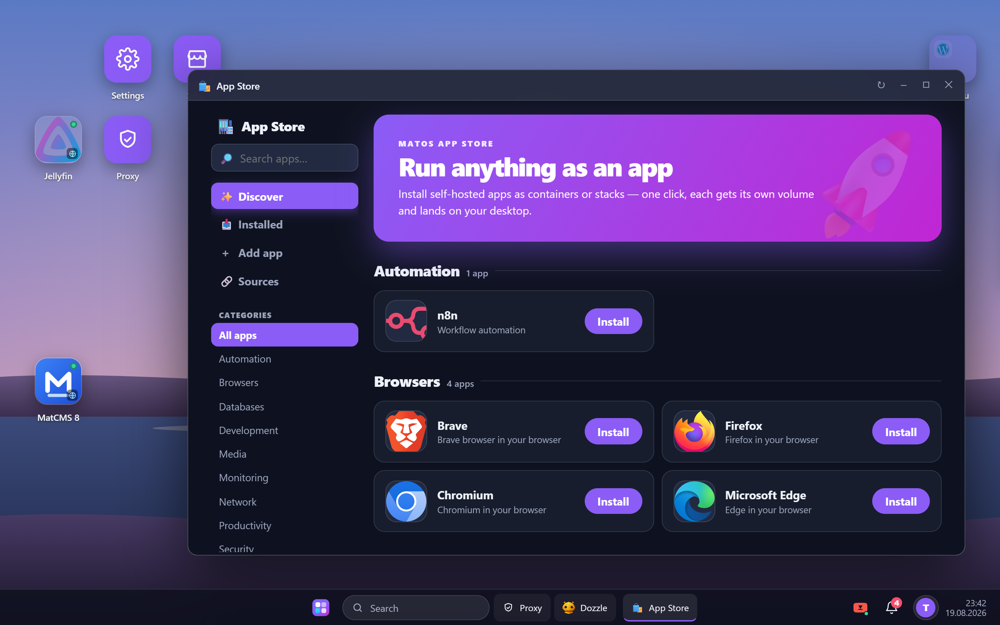
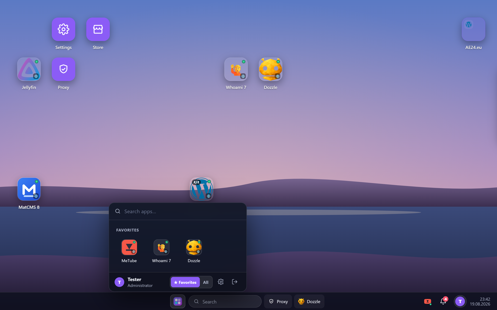
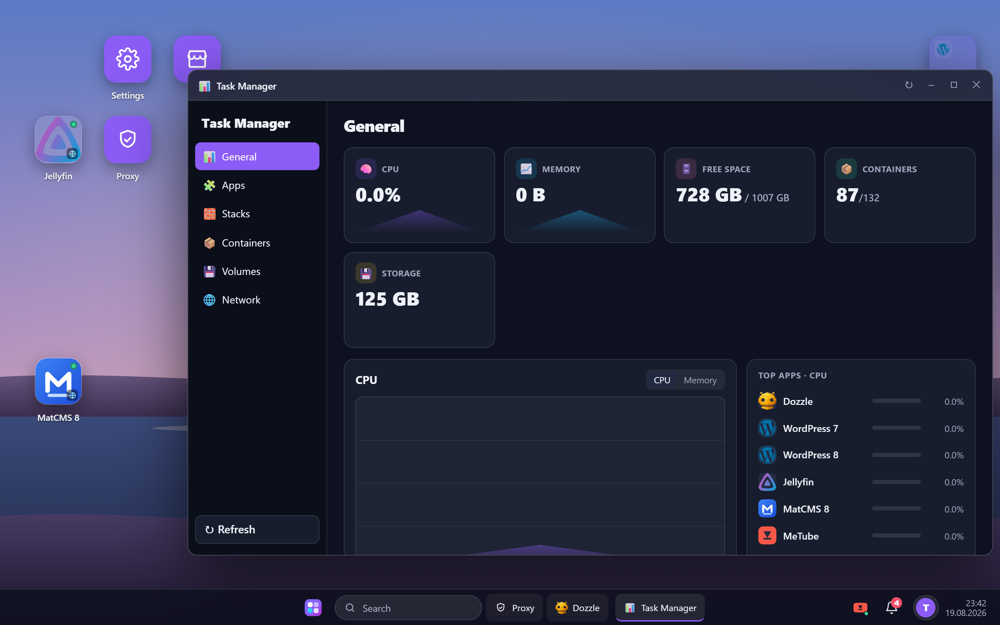
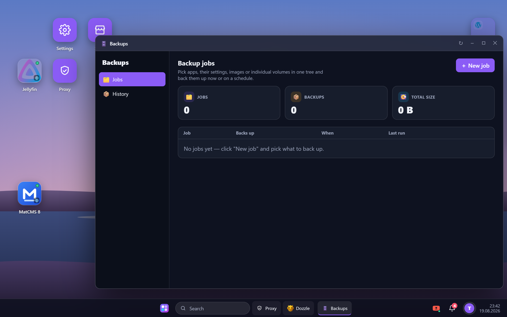
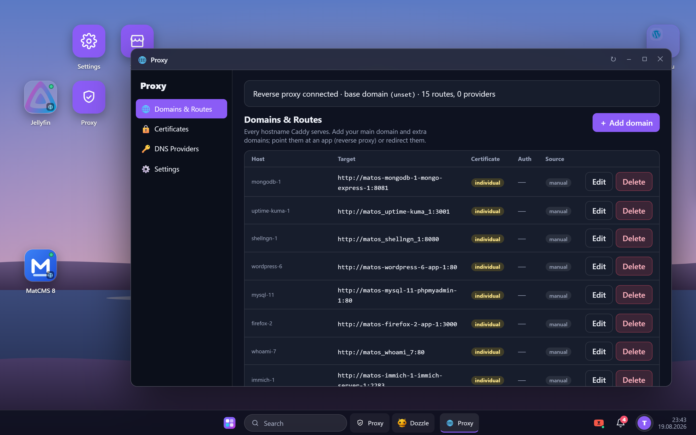
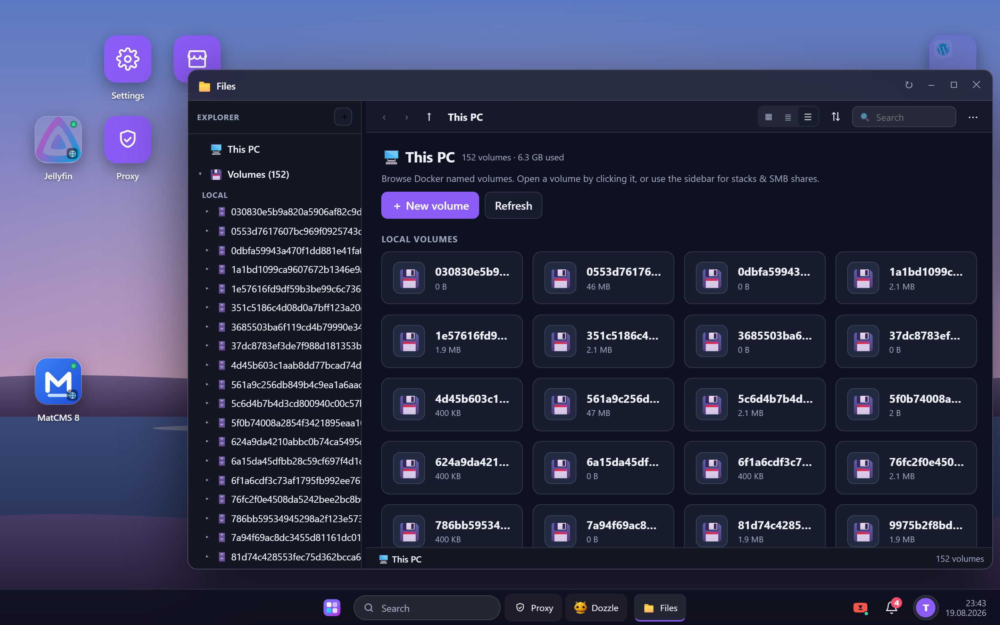
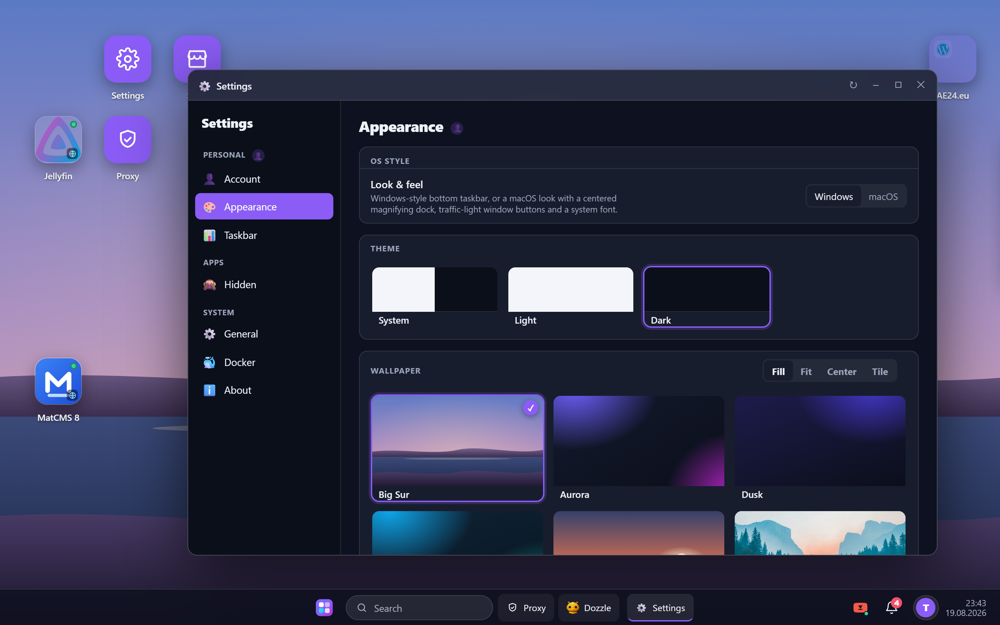
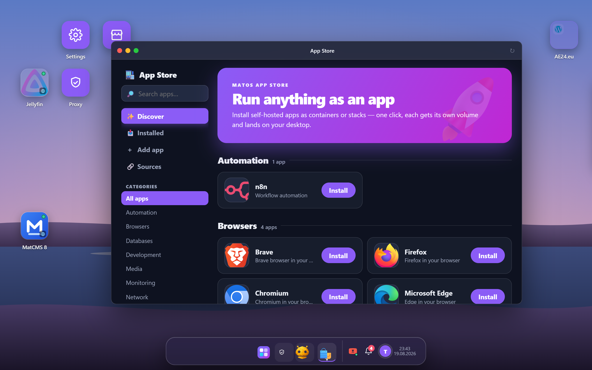

<div align="center">


# matOS

**A desktop operating system for your Docker host – in the browser.**

Every container is an app icon, every app opens in a window. An App Store that installs
self-hosted software in one click, a reverse proxy that gives each app a domain, backups
of whole apps, live monitoring and a file explorer for your volumes. One stack, no cloud.

</div>



---

## What this is about

Running self-hosted software on Docker usually means a terminal, a pile of `docker-compose.yml`
files and a browser full of `:8080` tabs. matOS puts a real desktop on top of your engine:
containers show up as app icons, open in draggable windows, and new software installs from an
App Store — each app in its own volume, wired to a reverse proxy, backed up and monitored from
the same place. It's the control-plane sibling to **[Matcad](https://github.com/Real-TTX/Matcad)**
(the Caddy reverse-proxy manager): matOS runs the *apps*, Matcad does the *routing*.

## At a glance

**Desktop & windows**
- Every container is an **app icon** on the desktop; a click opens it in a **draggable, resizable
  window** (position & size are remembered)
- **Windows-11-style Start menu** with a **Favorites** grid and an *All apps* view, folders, and
  a taskbar with pinned apps, search and a system tray
- **Desktop widgets** (clock with analog/digital/text faces, CPU/memory, container status) and
  desktop/Start folders
- **Two OS styles**: the default Windows look or a **macOS** skin — a centered magnifying **dock**,
  traffic-light window buttons and a system font — plus light/dark themes and wallpapers

**App Store**
- Install self-hosted apps as **single containers or compose stacks** in one click — each gets its
  own volume and a desktop icon
- **Install-time options**: tick optional add-on services (e.g. *phpMyAdmin*) or either/or variants,
  composed into one stack
- Add your own catalogs, **Git repositories** (public or private, GitOps auto-update), or build an
  app in the **App Builder** (icon, store page, widgets, options) with a live preview
- Store detail pages pull **versions from Docker Hub** and the **README from GHCR/GitHub**

**Reverse proxy (Matcad)**
- Give an app a **domain** the simple way — *pick the app, type the host*; matOS knows the container
  and port and wires the upstream for you
- Everything else lives under **Advanced**: manual upstreams, redirects, **wildcard** domains,
  authentication and **DNS-01 wildcard certificates** (e.g. netcup)
- Automatic HTTPS through Caddy; routes, certificates and DNS providers in one window

**Backups**
- Build **jobs** from one tree: tick a **whole app**, or just its **settings / image / individual
  volumes** — run now or on a schedule with retention
- A whole-app backup captures the **compose & config pinned to the exact image digest** — and
  optionally the **image itself** — so a restore brings *everything* back **running, offline**
- Store on any volume (incl. **SMB** shares) and an optional sub-path; a **History** tab lists every
  backup with its size to restore, download or delete

**Monitoring & files**
- **Task Manager**: live CPU/memory, free space and container counts; per-app, per-stack, per-
  container, volumes and networks — with logs and stats over SSE
- **File Explorer** for your named volumes: browse, upload/download, edit with syntax highlighting,
  and *Open with* an app

**Users**
- Local login with **roles** (Admin / User), restart-persistent sessions
- **Account** lives in Settings: change your password without leaving the desktop

## Screenshots

### Start menu – Favorites and all apps



Opens on a **Favorites** grid you curate (right-click any app → *Add to Favorites*, drag to
reorder). The footer toggles between **Favorites** and **All** and remembers the choice; typing
searches everything.

### Task Manager – everything the engine is doing



CPU, memory, free space and container counts up top, a live graph and the busiest apps beside it.
Separate views for apps, stacks, containers, volumes and networks — each with the actions you need.

### Backups – jobs from one tree



One job, one tree: whole apps or their settings / image / individual volumes, to any target
(SMB included), now or on a schedule. Restores recreate volumes *and* containers so the app runs
again — offline if the image was bundled.

### Proxy – a domain per app



Give an app a domain by picking it from a list; matOS derives the upstream. Wildcards, redirects,
DNS-01 certificates and authentication are one *Advanced* click away. Automatic HTTPS via Caddy.

### File Explorer and Settings

| Files | Settings |
|---|---|
|  |  |

Browse and edit your Docker volumes; change appearance, taskbar, the OS style and your account
password — all inside the desktop.

### A macOS look, if you like



*Settings → Appearance → OS style: macOS* turns the taskbar into a centered, magnifying dock and
gives windows traffic-light buttons and a system font. The default Windows look is untouched.

## Quick start

matOS runs as a small stack: **matOS** itself plus the sibling **Matcad** reverse proxy (Caddy).

```yaml
name: matos
services:
  matos:
    image: ghcr.io/real-ttx/matos:latest
    container_name: matos
    restart: unless-stopped
    ports:
      - "4333:8080"
    environment:
      MatOS__Matcad__ApiUrl: "http://matcad:4433"
      MatOS__Matcad__ApiKey: "change-me"   # must match Matcad's key below
    volumes:
      - matos-data:/app/data
      - /var/run/docker.sock:/var/run/docker.sock            # matOS controls the engine
      - /var/lib/docker/volumes:/var/lib/docker/volumes       # so the File Explorer can read volumes
    extra_hosts: [ "host.docker.internal:host-gateway" ]
    networks: [ matnet ]

  caddy:
    image: ghcr.io/real-ttx/matcad-caddy:latest
    container_name: matos-caddy
    restart: unless-stopped
    ports: [ "80:80", "443:443", "443:443/udp", "21000-21049:21000-21049" ]
    volumes: [ caddy-data:/data, caddy-config:/config ]
    networks: [ matnet ]

  matcad:
    image: ghcr.io/real-ttx/matcad:latest
    container_name: matos-matcad
    restart: unless-stopped
    environment:
      Matcad__ApiKey: "change-me"          # must match matOS above
      Matcad__Caddy__AdminUrl: "http://caddy:2019"
    volumes: [ matcad-data:/app/data ]
    networks: [ matnet ]

volumes: { matos-data: , caddy-data: , caddy-config: , matcad-data: }
networks: { matnet: }
```

```bash
docker compose up -d
```

Then open **http://localhost:4333** and complete the **first-run setup** (create the admin
account). The `matos-data` volume keeps the config, users and session keys, so an update is just
`docker compose pull && docker compose up -d`.

Published images (GitHub Container Registry):

| Tag | Built from | Use it for |
|---|---|---|
| `ghcr.io/real-ttx/matos:latest` | `main` | releases |
| `ghcr.io/real-ttx/matos:nightly` | `dev` | the newest features |

### matOS on its own (no proxy layer)

The reverse proxy is optional — leave `caddy` and `matcad` out and drop `MatOS__Matcad__*`. The
Proxy app is then inactive; everything else works. Apps still open in windows via their published
ports.

### From source

```bash
docker compose up -d --build     # builds matOS, pulls caddy/matcad
```

### Settings that matter

| Variable | Default | Meaning |
|---|---|---|
| `MatOS__Docker__Endpoint` | `unix:///var/run/docker.sock` | Docker engine socket |
| `MATOS_DATA_DIR` | `/app/data` | Data directory (JSON config, users, sessions, keys, git clones) |
| `MatOS__Matcad__ApiUrl` / `ApiKey` | – | Matcad REST API for the Proxy app (key must match Matcad) |
| `MATOS_EMBED_PORTS` | `21000-21049` | Host port range Caddy uses to embed apps DNS-free |
| `ASPNETCORE_URLS` | `http://+:8080` | Bind address inside the container |

## How it is built

- **ASP.NET Core 10** (Razor Pages + minimal API), a TagHelper control library, a **vanilla-JS
  window manager** — no framework, no build step
- **Docker.DotNet** talks to the mounted engine socket; **`docker compose`** deploys stacks
- **JSON** is the primary store (config, users, sessions) on the mounted `/app/data` volume;
  **DataProtection** keys live there too, so sessions survive a restart
- Live logs & stats over **SSE**; whole-app backups use `docker save`/`load` for offline restores
- `git` is bundled so Git app sources can be cloned (private repos via a token)

## Status

| Area | Status |
|---|---|
| Desktop shell, window manager, taskbar, Start menu, folders, widgets | ✅ |
| Login, roles, restart-persistent sessions, account/password | ✅ |
| App Store: catalog, install engine (image + compose), install options | ✅ |
| Remote catalogs, **Git sources (GitOps)**, **App Builder** | ✅ |
| Reverse proxy (Matcad): app-based routes, wildcards, DNS-01 certs, auth | ✅ |
| Backups: jobs, whole-app + image, volumes, schedules, SMB, history | ✅ |
| Task Manager, File Explorer, Settings, themes (Windows + **macOS**) | ✅ |
| Entra/AD login, more polish | planned |

## Branches & versioning

| Branch | Purpose | Image tag |
|---|---|---|
| `main` | Release | `ghcr.io/real-ttx/matos:latest` |
| `dev` | Development | `ghcr.io/real-ttx/matos:nightly` |

matOS is one of the **Mat*** siblings (Matcad, MatFile, …) and shares their stack and conventions.
